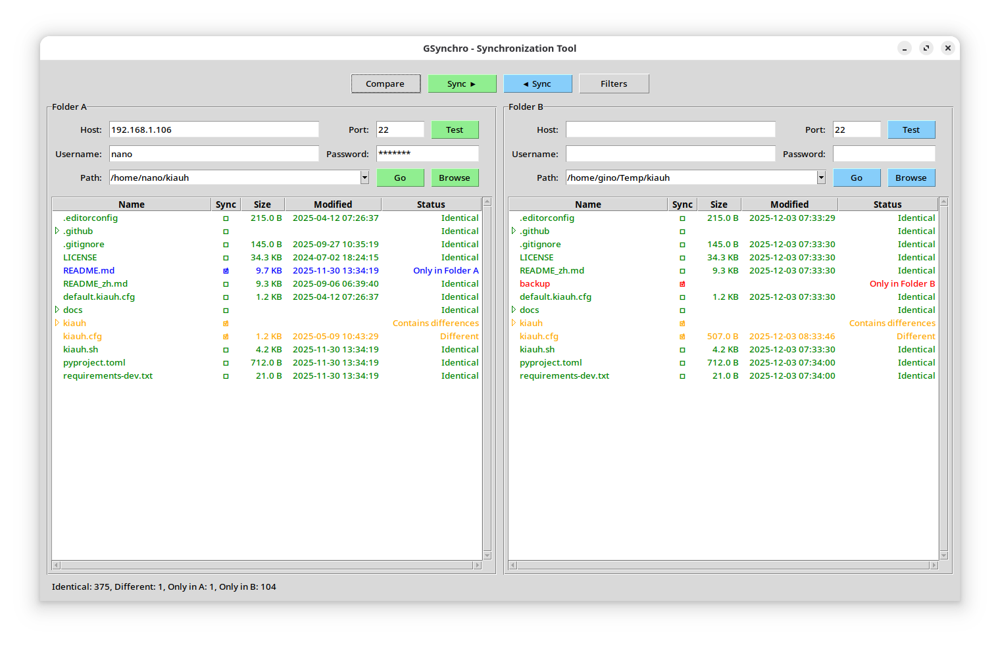
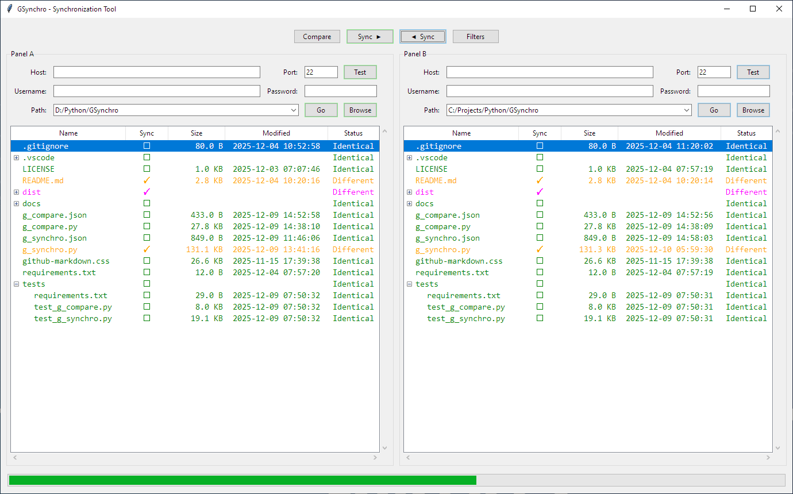
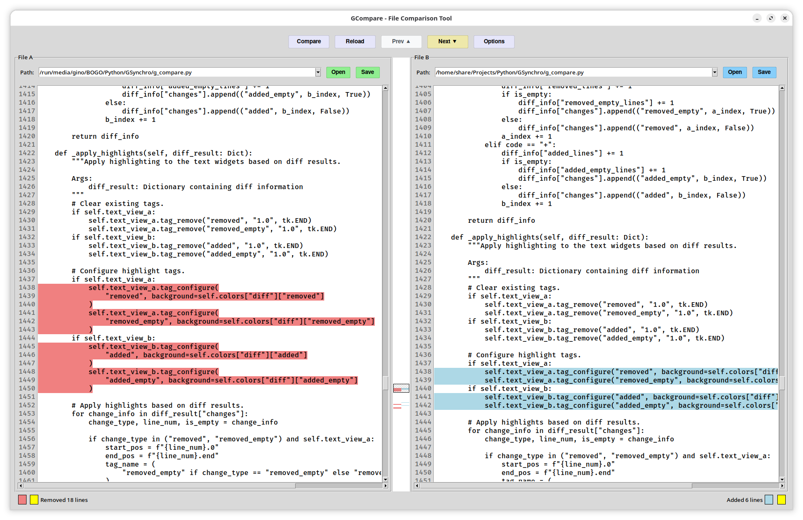

# GSynchro

GSynchro is a suite of graphical tools designed for file comparison and synchronization. The project includes two main applications:

1. **GSynchro** - A GUI tool for comparing and synchronizing files and directories between two locations
2. **GCompare** - A side-by-side file comparison tool with advanced diff visualization

## GSynchro - Directory Synchronization Tool

GSynchro provides a clear side-by-side view to visualize differences and enables flexible synchronization operations between local and remote file sets. It is particularly useful for developers, system administrators, or anyone needing to maintain consistency between local and remote file sets.





### Key Features

*   **Side-by-Side Comparison**: Visually compare the contents of two directories in a hierarchical tree view.
*   **Local & Remote Support**: Synchronize between:
    *   Local folder to local folder.
    *   Local folder to a remote folder over SSH.
    *   Remote folder to a local folder over SSH.
    *   Remote folder to another remote folder over SSH.
*   **SSH Integration**: Built-in support for SSH connections using `paramiko` and `scp` for secure remote operations. It includes an SSH connection tester and a remote directory browser.
*   **Detailed Status**: Files are marked with clear statuses after comparison:
    *   `Identical`: Files are the same.
    *   `Different`: Files have the same name but different content (based on size and MD5 hash).
    *   `Only in A` / `Only in B`: File exists only in one of the two locations.
    *   `Contains differences`: A directory contains items that are not identical.
*   **Flexible Synchronization**:
    *   Synchronize from left to right (`A` -> `B`) or right to left (`B` -> `A`).
    *   Selectively include or exclude individual files and directories from a sync operation using checkboxes.
*   **Powerful Filtering**: Define custom filter rules (with wildcard support) to exclude files and directories (like `.git`, `__pycache__`, `*.log`) from scans and comparisons.
*   **File Operations**:
    *   Open files directly from the application (downloads remote files to a temporary location first).
    *   Delete files and directories from both local and remote locations.
*   **Persistent Configuration**: Automatically saves your settings (SSH details, folder history, filter rules, and window size) to a `g_synchro.json` file for convenience.
*   **Cross-Platform**: Built with Python's standard `tkinter` library, making it compatible with Windows, macOS, and Linux.

## GCompare - File Comparison Tool

GCompare is a sophisticated side-by-side text file comparison tool that provides visual diff highlighting and advanced features for developers and users who need to compare file contents.



### Key Features

*   **Side-by-Side View**: Compare two files simultaneously in synchronized panels
*   **Visual Diff Highlighting**: 
    *   Removed lines highlighted in light coral
    *   Added lines highlighted in light blue
    *   Empty line changes highlighted in yellow
*   **Interactive Diff Map**: A visual overview of all differences with clickable navigation
*   **Synchronized Scrolling**: Both panels scroll together to maintain alignment
*   **Advanced Comparison Options**:
    *   Ignore whitespace differences
    *   Ignore case differences
    *   Configure tab size for proper alignment
*   **Customizable Display**:
    *   Multiple font families and sizes available
    *   Optional line numbers display
    *   Line wrapping toggle
*   **File Management**:
    *   Load files from dialog or command line arguments
    *   Save changes with confirmation dialogs
    *   Reload files with unsaved change detection
    *   File history for quick access to recent files
*   **Auto-Compare**: Automatically compares files when both are loaded
*   **Persistent Configuration**: Saves window geometry, file history, and user preferences to `g_compare.json`
*   **Command Line Support**: Launch with files pre-loaded: `python g_compare.py file1.txt file2.txt`

### Comparison Features

*   **Real-time Status**: Shows count of removed/added lines and empty line changes
*   **Diff Algorithm**: Uses Python's `difflib` for accurate difference detection
*   **Visual Navigation**: Click on diff map to jump to specific differences
*   **Scroll Marker**: Shows current viewport position in the diff map
*   **Color-coded Changes**: Intuitive visual distinction between different types of changes

## Getting Started

Follow these instructions to get GSynchro running on your local machine.

### Prerequisites

*   Python 3.6 or higher

### Installation

1.  **Clone the repository:**
    ```sh
    git clone <repository-url>
    cd GSynchro
    ```

2.  **Install the required dependencies using the `requirements.txt` file:**
    ```sh
    pip install -r requirements.txt
    ```

## Usage

### GSynchro - Directory Synchronization

To run the GSynchro application, execute the `g_synchro.py` script from the project's root directory:
```sh
python g_synchro.py
```

### GCompare - File Comparison

To run the GCompare application, execute the `g_compare.py` script from the project's root directory:

**Basic Usage:**
```sh
python g_compare.py
```

**With Files Pre-loaded:**
```sh
python g_compare.py file1.txt file2.txt
```

**Command Line Arguments:**
- `file1.txt`: Path to the first file (displayed in Panel A)
- `file2.txt`: Path to the second file (displayed in Panel B)

Both applications support the same prerequisites and installation requirements.
